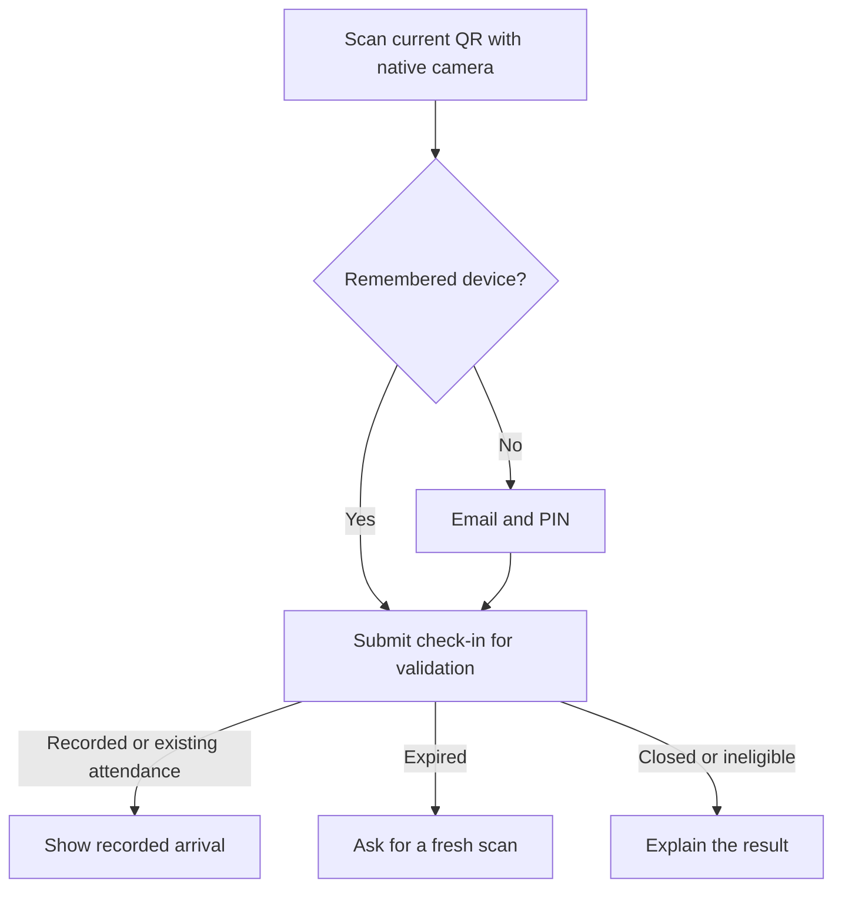

# PitchPresence — UI/UX Design Specification

Version 1.1 · Light theme · Isolated team workspaces

This document defines the visual language and user experience for the PitchPresence web application. It is the source of truth for frontend design and review. The backend and frontend implement this direction; the staff/team flows below supersede the original single-team onboarding assumptions.

Product behaviour follows the [PRD](PitchPresence_V1_Detailed_PRD.pdf), [backend architecture](docs/backend/architecture.md), and [API integration guide](docs/backend/api.md). Examples of players, sessions, payments, and product screens in marketing are demonstration content.

## 1. Product and Creative Direction

**Warm football editorial.** PitchPresence should feel like a thoughtfully designed team handbook brought onto the pitch: warm paper, confident headlines, real football, and clear records.

The landing page speaks first to coaches and managers who want less administration. The application serves two equally important experiences: players completing a quick action and management keeping accurate records.

### Reference synthesis

| Reference          | Influence                                                                                        | PitchPresence adaptation                                                            |
| ------------------ | ------------------------------------------------------------------------------------------------ | ----------------------------------------------------------------------------------- |
| DICE               | Condensed headlines, strong contrast, pill actions, flat surfaces, and dark feature bands.       | Large football statements on the landing page; quiet, readable operational screens. |
| Flutterwave Design | Cream canvas, editorial composition, generous section spacing, and restrained amber punctuation. | Warm backgrounds and authentic team photography; amber remains a small accent.      |
| Duolingo           | Immediate feedback, approachable explanations, and tactile interactions.                         | A subtle press edge on primary actions and a brief confirmation animation.          |

These references supply principles rather than a component library. PitchPresence uses its own palette, font pairing, corner system, and logo. Their conflicting measurements and proprietary typefaces are not imported as requirements.

### Experience principles

- **The action comes first.** Opening attendance, checking in, and confirming payment should have an obvious next step.
- **Football supplies the character.** Use real pitches, coaching, arrivals, and team routines to establish the setting.
- **Recorded means recorded.** A success screen represents a confirmed backend result. Waiting, failure, and uncertainty remain distinct.
- **Expressive introductions, calm workspaces.** Landing pages can be typographically loud; rosters and payments remain easy to inspect.
- **One product across roles.** Players and management share components, vocabulary, and status meanings.

## 2. Visual Identity and Design Tokens

### Colour

| Token                      | Value     | Role                                                        |
| -------------------------- | --------- | ----------------------------------------------------------- |
| `--color-canvas`           | `#FFF9F1` | Default page background and navigation.                     |
| `--color-surface`          | `#FFFFFF` | Form fields, tables, detail panels, and QR backing.         |
| `--color-ink`              | `#171D18` | Headlines, body text, and icons.                            |
| `--color-muted`            | `#596257` | Supporting text, timestamps, and metadata.                  |
| `--color-primary`          | `#195C3C` | Primary actions, selected navigation, and focus indicators. |
| `--color-primary-deep`     | `#103C29` | Dark storytelling bands and primary-button press edges.     |
| `--color-accent`           | `#F5A623` | Small editorial marks and pending-state emphasis.           |
| `--color-success-surface`  | `#D7F5DE` | Confirmed attendance and payment backgrounds.               |
| `--color-divider`          | `#D8D0C2` | Decorative separators and card boundaries.                  |
| `--color-control-border`   | `#756F65` | Input boundaries and outlined controls.                     |
| `--color-error`            | `#9B2C2C` | Errors, destructive actions, and validation labels.         |
| `--color-error-surface`    | `#FCE9E5` | Error banners and destructive confirmation panels.          |
| `--color-disabled-surface` | `#E9E4DA` | Disabled control fill, with legible muted labels.           |

Green means the primary interaction or a confirmed outcome. Amber means attention or processing, never success. Error red is functional and restrained. Pair every status colour with a label and, where helpful, an icon.

Use white labels on green actions and ink labels on amber fills. Amber is not a body-text colour on cream. Decorative borders do not replace the stronger boundaries needed to recognise inputs. QR modules remain pure black on pure white.

Measured contrast pairs: ink/cream ≈16.38:1; muted/cream ≈6.07:1; white/primary green ≈7.96:1; control border/cream ≈4.76:1; ink/amber ≈8.46:1. Check all additional states independently.

### Typography

Use **Antonio Bold** for brief editorial statements and **Inter** for interface text. Self-host both, preserve their font licences, and use system sans-serif fallbacks. Neither proprietary reference fonts nor their stylistic-set settings are required. [Antonio licence](https://raw.githubusercontent.com/google/fonts/main/ofl/antonio/OFL.txt), [Inter licence](https://raw.githubusercontent.com/google/fonts/main/ofl/inter/OFL.txt)

| Role                         | Family / weight | Size                       | Line height | Tracking |
| ---------------------------- | --------------- | -------------------------- | ----------- | -------- |
| Landing hero                 | Antonio / 700   | 48px mobile → 96px desktop | 1.05        | −0.02em  |
| Landing section statement    | Antonio / 700   | 36px mobile → 56px desktop | 1.1         | −0.02em  |
| Short success headline       | Antonio / 700   | 40px mobile → 64px desktop | 1.1         | −0.02em  |
| Application page heading     | Inter / 700     | 28px mobile → 36px desktop | 1.2         | −0.02em  |
| Panel heading                | Inter / 600     | 20px                       | 1.3         | −0.01em  |
| Body and form input          | Inter / 400     | 16px                       | 1.5         | normal   |
| Button and form label        | Inter / 600     | 16px                       | 1.25        | normal   |
| Supporting copy / table text | Inter / 400–600 | 14px                       | 1.5         | normal   |
| Nonessential caption         | Inter / 500     | 12px                       | 1.4         | normal   |
| Editorial eyebrow            | Inter / 600     | 12px                       | 1.4         | 0.08em   |

Scale display sizes smoothly between mobile and desktop. Use uppercase only for short display statements and editorial eyebrows. Buttons and operational headings use sentence case. Names, session details, errors, and amounts never use the condensed face. Apply tabular numerals to amounts, counters, and timestamps.

### Spacing, surfaces, and shapes

- Spacing scale: 4, 8, 12, 16, 20, 24, 32, 40, 48, 64, 80, and 96px.
- Page gutters: 20px mobile, 32px tablet, and 48px desktop. At 360px, preserve these gutters rather than shrinking text.
- Panel padding: 16px mobile and 24px on wider layouts. Standard content gap: 16px; related labels and values: 8px.
- Application section gap: 32px mobile and 48px desktop. Landing section padding: 64px mobile and 96px desktop.
- Cards, media, and dialogs: 12px radius. Inputs: 8px. Buttons and status chips: full pill radius.
- Primary and secondary buttons: minimum 48px height; compact controls: minimum 44px hit area. Row actions may look smaller but retain the hit area.
- Use 1px panel separators and a restrained 2px solid lower edge on primary buttons. On press, move the content down 1px and reduce the edge; retain total control height.
- Avoid blurred shadows, glows, decorative gradients, and glass effects. Darkening a photograph to support readable captions is allowed; default to captions outside the image.

### Identity and iconography

Use the full **PitchPresence** wordmark with an original small pitch-line emblem: a rounded field outline, halfway line, centre circle, and one filled presence dot. The dot signals the product without becoming a generic notification badge. The wordmark uses Inter Bold. Do not reuse the reference brands' mascots or marks.

Use one consistent family of 2px-stroke outline icons at 20–24px. Labels accompany primary navigation. Player avatars default to initials; do not imply that avatar uploads are available in V1.

### Canonical CSS starting tokens

```css
:root {
  --color-canvas: #fff9f1;
  --color-surface: #ffffff;
  --color-ink: #171d18;
  --color-muted: #596257;
  --color-primary: #195c3c;
  --color-primary-deep: #103c29;
  --color-accent: #f5a623;
  --color-success-surface: #d7f5de;
  --color-divider: #d8d0c2;
  --color-control-border: #756f65;
  --color-error: #9b2c2c;
  --color-error-surface: #fce9e5;
  --color-disabled-surface: #e9e4da;

  --font-display: 'Antonio', ui-sans-serif, system-ui, sans-serif;
  --font-ui: 'Inter', ui-sans-serif, system-ui, sans-serif;
  --text-display: clamp(3rem, 6.7vw, 6rem);
  --text-statement: clamp(2.25rem, 4vw, 3.5rem);
  --text-page-heading: clamp(1.75rem, 2.5vw, 2.25rem);
  --text-body: 1rem;
  --text-supporting: 0.875rem;
  --text-caption: 0.75rem;

  --space-unit: 0.25rem;
  --radius-control: 0.5rem;
  --radius-panel: 0.75rem;
  --radius-pill: 9999px;
  --control-height: 3rem;
  --content-max: 80rem;
  --motion-fast: 150ms;
  --motion-panel: 250ms;
}
```

## 3. Landing Page: Product Story

### Content sequence

| Section          | Story and composition                                                                                                                                                                          | Actions                                                         |
| ---------------- | ---------------------------------------------------------------------------------------------------------------------------------------------------------------------------------------------- | --------------------------------------------------------------- |
| Header           | Wordmark, How it works, Attendance, Dues; cream canvas with a thin divider.                                                                                                                    | Create your team; staff Sign in; accessible menu on mobile.     |
| Hero             | **MORE FOOTBALL. LESS ADMIN.** Bold text beside an HD photograph of a grassroots training pitch. Copy: “Keep training attendance and monthly dues in one place, so you can focus on the team.” | Primary: **Create your team**. Secondary: **See how it works**. |
| Walkthrough      | **OPEN. SCAN. CONFIRMED.** An animated interface sequence shows management opening attendance, players arriving separately, and recorded check-ins.                                            | Play walkthrough; chapter controls.                             |
| Attendance band  | Deep-green, full-width band with light copy, a coach image, and a readable attendance preview. Copy: “One training session. Every arrival recorded.”                                           | View the attendance chapter.                                    |
| Dues story       | Cream canvas; a clearly labelled example monthly history beside payment details. Copy: “Know which months are paid.” Explain in-app and external payment channels.                             | View the dues chapter.                                          |
| Management story | Coach/team photograph beside live roster and dues previews. Copy: “A clear view for the people running the team.”                                                                              | Anchor back to the walkthrough.                                 |
| Closing section  | Compact statement: “Keep the records. Get back to football.” Explain that players join through a team invitation.                                                                              | Create your team; existing staff/player sign-in.                |
| Footer           | Wordmark, product-section anchors, sign-in link, and photo credits where required.                                                                                                             | Existing destinations only.                                     |

Hero layout is 45% text / 55% media on tablet and desktop when minimum content widths fit. On mobile, place the statement, copy, and actions before the media. Buttons wrap or stack rather than truncate. Use a 16:10 desktop image and a 4:3 mobile crop.

The landing page has a 1280px content maximum, with dark bands and photographs allowed to fill their section backgrounds. Use real product previews rather than generic statistic cards. Photography does not sit behind dense paragraphs or action labels.

### Claims and conversion boundaries

- V1 serves an existing single team. There is no public Create team, pricing checkout, subscription, or manager sign-up flow.
- Signed-in visitors use **Open dashboard** in place of Sign in; route them to their role's home.
- Players without an invitation see: “Joining your team? Ask your coach or manager for an invite link.”
- Mark walkthroughs **Product demo**. Use fictional names and nonfunctional sample QR content.
- Explain that rotating QR reduces old screenshot reuse; it does not independently prove a player's location.
- Describe manager location capture as a one-time session-start reading. Do not imply live player tracking, lateness classification, or overdue penalties.
- Add no fabricated testimonials, club partnerships, usage totals, or payment success statistics.

## 4. Photography, Footage, and Animation

### Art direction and shot list

Use licensed stock images of everyday football training: natural light, visible pitch texture, mixed arrival moments, coaches organising players, and believable team routines. Prioritise images that feel appropriate to grassroots football in Nigeria, without inventing the photographed team's identity or location. Avoid trophy-room spectacle, heavy stadium glamour, posed corporate meetings, or unrelated generic fitness imagery.

| Asset                       | Placement                      | Composition and crop                                                                                                      |
| --------------------------- | ------------------------------ | ------------------------------------------------------------------------------------------------------------------------- |
| Training pitch wide         | Landing hero                   | Players warming up, recognisable field lines, and open space; retain the pitch rather than only faces.                    |
| Coach briefing              | Attendance / management story  | Coach organising players, with the group readable at small sizes.                                                         |
| Staggered arrivals          | Walkthrough support            | Arriving player carrying boots or a kit bag; documentary framing.                                                         |
| Phone at the pitch          | Check-in explanation           | Phone in a training setting; overlay product UI separately so stock-screen content does not misrepresent the application. |
| Team huddle                 | Registration split panel       | Portrait-friendly group composition with room for a short caption.                                                        |
| Field or training equipment | Sign-in / recovery split panel | Calm, crop-flexible image; reserve human-focused images for onboarding and the story.                                     |

Reuse a small coherent collection rather than changing imagery on every form step. Decorative application photography stays on onboarding and optional overview introductions; operational split panels contain useful information.

### Asset delivery contract

- Acquire prominent landscape masters at least 2400px wide. Portrait-panel source crops must support at least 1200px rendered width at high density.
- Keep originals and licences in an asset register; store frontend derivatives under `apps/web/public/media`. The register records source URL, creator, permitted use, attribution, dimensions, alt text, and crop focal point.
- Prepare responsive derivatives at 320, 640, 960, 1440, and 1920px; prefer AVIF/WebP with a suitable fallback. Do not send the master to every device.
- Target hero delivery below 250KB on mobile and 500KB on desktop. Give images explicit dimensions/aspect ratios and meaningful focal points. Load only the initial hero eagerly; lazy-load lower sections.
- Download approved assets into the product's asset pipeline rather than relying on third-party hotlinks. Asset acquisition occurs during frontend implementation and does not require a paid stock purchase by default.
- Informative photos receive contextual alt text. Decorative photos use empty alt text. Product explanation remains available without any photo.

Use responsive sizing and reserved layout space as described in the [Next.js image documentation](https://nextjs.org/docs/app/api-reference/components/image).

### Twenty-second product walkthrough

| Time          | Scene                                                                                     | Visible explanation                                         |
| ------------- | ----------------------------------------------------------------------------------------- | ----------------------------------------------------------- |
| 0–5 seconds   | Manager opens attendance; a demonstration QR appears.                                     | “Open attendance for training.”                             |
| 5–10 seconds  | Two example players arrive at different times; the roster updates.                        | “Players scan when they arrive.”                            |
| 10–14 seconds | A checkmark and recorded arrival time resolve into a player confirmation.                 | “Each check-in has a recorded time.”                        |
| 14–20 seconds | An unpaid month changes after verified payment; an external-confirmation example follows. | “Keep in-app and external payments in one monthly history.” |

Render the sequence from product-shaped interface components, keeping text as real text. Do not require a large prerendered video for the main explanation. Label sample arrival times and payment amounts as demo data. Demo QR content must never contain a live attendance token.

Use an explicit Play walkthrough action; autoplay is off by default. Provide Play/Pause, Replay, and named Attendance/Dues chapter controls. The desktop stage can hold an app panel and phone preview; mobile shows one focused scene at a time. All chapter explanations remain readable when playback is stopped.

An optional licensed 8–12-second training clip can occupy the hero image frame. It starts only after user activation, plays muted and inline, and has pause/replay controls. Supply a poster image and target a maximum 3MB clip with a 1080p desktop source and smaller mobile derivative. If no suitable footage is available, the photograph and component walkthrough satisfy the story without a blank video slot.

### Motion rules

| Interaction                   | Treatment                                                                             |
| ----------------------------- | ------------------------------------------------------------------------------------- |
| Button hover / press          | 120–180ms colour and 1px press feedback.                                              |
| Detail panel or dialog        | 200–300ms opacity transition and no more than 8px translation.                        |
| Confirmed check-in or payment | One checkmark reveal, maximum 600ms; final content is immediately available.          |
| Loading                       | Subtle skeleton or labelled progress indicator; no layout movement.                   |
| Landing-section entrance      | One short reveal when entering view; content is visible if scripts or observers fail. |
| QR token refresh              | No transition, blur, scaling, or decorative scan animation.                           |

Respect `prefers-reduced-motion`: remove expressive movement and replace the walkthrough with selectable static scenes. Keep explicit media controls. Pause nonessential playback offscreen or in a background tab. Do not lock scrolling, run parallax backgrounds, or repeat confetti. Persistent automatic motion, if introduced later, requires a pause mechanism under [W3C pause/stop guidance](https://www.w3.org/WAI/WCAG22/Understanding/pause-stop-hide).

## 5. Information Architecture and Responsive Layouts

### Navigation

| Audience   | Primary destinations              | Secondary destinations                                                            |
| ---------- | --------------------------------- | --------------------------------------------------------------------------------- |
| Player     | Home, Attendance, Dues, Account   | PIN recovery and remembered-device management within Account.                     |
| Management | Overview, Training, Players, Dues | Account, Settings, and Audit in secondary navigation; Invitations within Players. |

Users resume team creation or staff invitation acceptance when unassigned; otherwise they land in their role's home after sign-in, unless continuing a valid pending check-in or payment flow. There is no team switcher or role switcher in V1. Keep back navigation visible on focused forms and detail pages. The active destination uses a green indicator plus a label/shape change, not colour alone.

### Breakpoints and layout contracts

| Width            | Navigation                                                              | Page composition                                                                                                                |
| ---------------- | ----------------------------------------------------------------------- | ------------------------------------------------------------------------------------------------------------------------------- |
| Below 768px      | Compact header; four labelled bottom destinations on application pages. | One column; summary before action/list. Focused authentication and check-in pages omit bottom navigation.                       |
| 768–1199px       | Compact top navigation, with account and secondary actions in a menu.   | Split authentication and task panels when each retains at least 320px of content width after internal padding. Otherwise stack. |
| 1200px and above | 224px persistent sidebar on application pages.                          | Content maximum 1280px; functional summary/workspace splits, typically 40/60.                                                   |

At 768px with 32px outer gutters, a 24px split gap, and 24px panel padding, equal columns would leave only 292px of content width, so stack them. An equal split becomes viable at 824px, where each column retains 320px of content width. Progress toward 40/60 operational and 45/55 authentication splits only when the smaller panel still meets that minimum.

The split describes the content region after navigation and gutters, not the entire viewport. Tablet and desktop content order remains the same as mobile reading order. A sidebar or secondary panel must never force horizontal scrolling across the whole page. Narrow or enlarged-text layouts automatically stack.

Use page-level scrolling. Sticky summaries are allowed only when their full contents fit beneath the header; otherwise they scroll normally. Tables can have a labelled internal scroll region, but key player/status/action content is available as stacked rows on mobile. Dialogs become full-width bottom sheets on mobile and centred panels on wider screens; they never cover their own action buttons with the keyboard.

### Shared page shells

- **Editorial shell:** landing header, large statement, story sections, and footer.
- **Authentication shell:** photography/short caption alongside one focused form; mobile replaces the photo with a compact brand header.
- **Player shell:** concise heading, current task/summary, and history/details. No decorative photo beside transaction records.
- **Management shell:** contextual summary alongside an actionable list, table, or selected detail panel.
- **Focused status shell:** centred check-in or payment outcome, with session/month context and one primary next action.

## 6. Shared Components and Interaction Patterns

| Component          | Specification                                                                                                                                                                                |
| ------------------ | -------------------------------------------------------------------------------------------------------------------------------------------------------------------------------------------- |
| Primary action     | Green pill, white Inter Semibold label, 48px minimum height, subtle lower edge. One dominant primary action per task area.                                                                   |
| Secondary action   | Surface/transparent pill, 1px control-border outline, ink label; invert to white outline/text on dark landing bands.                                                                         |
| Destructive action | Clearly named red-text action with confirmation; never reuse the primary green treatment for reversal or deactivation.                                                                       |
| Text action        | Underlined or clearly button-like label; 44px hit area for standalone controls; distinguish from ordinary text.                                                                              |
| Text input         | Visible label, 16px input text, 48px height, 8px corners, strong border; helper and error text below. Placeholder supplements the label.                                                     |
| PIN / OTP input    | One accessible numeric text input visually styled as separated cells if desired; PIN remains masked with a labelled Show/Hide control. Preserve leading zeroes and support whole-code paste. |
| Status chip        | Short label and optional icon, 12px supporting type, pill shape; colour follows meaning rather than decoration.                                                                              |
| Roster row         | Player identity, status/arrival, method where relevant, and a named action. Minimum 64px row; text can wrap.                                                                                 |
| Dues row           | Month or player name, Paid/Not paid, payment source/details, and a qualifying action. Pending transaction information is separate from monthly status.                                       |
| Summary panel      | Heading, labelled values, and next action. Maximum three primary statistics; no invented trend graphs.                                                                                       |
| Inline banner      | Icon, short heading, explanation, and recovery action; placed beside the affected task. Persists while action is required.                                                                   |
| Toast              | Brief ancillary confirmation such as Invite link copied; does not carry the only evidence of attendance or payment success.                                                                  |
| Dialog / sheet     | Contextual heading, explicit consequence, primary/secondary actions, focus containment, and restoration on exit. Submission errors retain entered information.                               |
| Skeleton           | Mirrors final geometry; marked busy, without fabricated data values.                                                                                                                         |
| Empty state        | Describes the absence of data and offers an available next step; no oversized mascot or animation.                                                                                           |

No action label should require inference: use **Mark present**, **Confirm external payment**, **Reverse confirmation**, and **End attendance**. A row action's accessible name includes the affected player's name.

## 7. Screen Specifications

### 7.1 Authentication and onboarding

Desktop/tablet uses a calm field or team-huddle photograph beside a form capped at 420px. The photograph and short caption remain consistent across steps to reduce visual disruption. Mobile presents the form immediately below the wordmark.

| Screen              | Content and actions                                                                                                       | Required states                                                                                                                                                     |
| ------------------- | ------------------------------------------------------------------------------------------------------------------------- | ------------------------------------------------------------------------------------------------------------------------------------------------------------------- |
| Player sign in      | `/player/sign-in`: email, four-digit PIN, Show PIN, **Sign in**, and **Forgot PIN?**                                      | Invalid credentials, unavailable account, rate limit, submission progress, session already established.                                                             |
| Invite registration | Name, email, four-digit PIN, **Join the team**, sign-in link for existing players.                                        | Missing/expired/revoked invitation, duplicate account, validation errors, email queued. Invalid invitations replace the form with guidance to request another link. |
| Verify email        | Destination email, six-digit code, **Verify email**, and resend action with 60-second cooldown.                           | Incorrect/expired code, attempt exhaustion, resend unavailable, verification progress, confirmed account.                                                           |
| PIN recovery        | Email request followed by OTP and replacement PIN.                                                                        | Neutral request response, invalid/expired code, rate limit, and successful reset with **Sign in**.                                                                  |
| Account             | Identity, team and role, remembered devices, device revocation, role-appropriate password/PIN recovery, and **Sign out**. | Loading, session expiry, failed revocation, current-device sign-out.                                                                                                |

Use `autocomplete` appropriate to email, current/new credentials, and one-time codes. Numeric inputs use `inputmode="numeric"` with text values, not a number input. State explicitly that changing the PIN or password signs out remembered devices. Staff self-register; roles are never editable. Staff password fields allow paste and show/hide, use 15–128 characters, and avoid composition rules.

#### Staff setup and access

| Screen                                           | Contract and UX                                                                                                                                                                                                    |
| ------------------------------------------------ | ------------------------------------------------------------------------------------------------------------------------------------------------------------------------------------------------------------------ |
| Staff signup `/signup`                           | Name, email, password; verify six-digit email code before team access. Clear password after submission.                                                                                                            |
| Staff sign in `/sign-in`                         | Email/password; Forgot password, Verify email, Create your team and Player sign in links.                                                                                                                          |
| Verification `/verify-email`                     | Email/code/resend; permits returning after interrupted signup.                                                                                                                                                     |
| Password recovery `/forgot-password`             | Neutral code request, new 15–128-character password, all-device sign-out, then staff sign-in.                                                                                                                      |
| Team creation `/onboarding/team`                 | Team name only; save once and go to Overview. Existing verified session resumes this step.                                                                                                                         |
| Staff invitation `/staff/join?invite=…`          | Show team and bound email. New staff register/verify; existing unassigned staff sign in or use their remembered session and accept. Reject wrong email, revoked/expired/used links and membership in another team. |
| Resume invitation `/onboarding/staff-invitation` | Accept stored invitation, request a replacement if invalid, or explicitly decline and create a team.                                                                                                               |
| Team settings `/management/team`                 | Staff list/invites and team bank setup in useful side-by-side panels, stacked on mobile.                                                                                                                           |

Coaches and managers have the same full MANAGER permissions. Each account has one team; email is unique across the product. No team switcher, transfers, promotions or team deletion. Players register through reusable team invitations; staff invitations are email-bound, single-use, seven-day links. Strip raw link tokens from history and retain only in memory. Pending invitations remain in the server account for verification/onboarding recovery.

Overview receives complete server totals, the current session, five recent sessions and setup flags. Optional tasks **Invite players**, **Set monthly dues**, **Connect team bank** stay resumable and never gate opening training. Opening with no active players warns that the saved roster will be empty and newly activated players join the next session. The team name remains visible in the application header.

Team bank setup selects a bank, resolves a ten-digit account number, shows the account name, asks explicit authorisation confirmation and reauthenticates the password. Display masked saved details only. Explain zero platform commission, provider fees borne by the team, and that resolution does not prove ownership. A READY provider-active destination enables checkout. A pending/review response offers **Check connection status** and support guidance; it never encourages duplicate creation. A bank replacement creates a new immutable profile for new checkouts, while existing checkouts keep the previous destination. Never ask staff for a Paystack secret key.

### 7.2 Player home and attendance

Player home shows a greeting, current month's dues state, and recent attendance. On wider screens, place the current summary beside the recent-activity list. Primary guidance reads **“At training? Scan the QR your coach is displaying with your phone's camera.”** It does not launch a check-in without a current token.

The Attendance page presents each eligible session with name/date, Present/Absent/Not checked in, and recorded arrival when present. On wider screens, use a compact explanation/summary beside history. Omit invented lateness scores, streaks, location maps, and sessions predating eligibility. A small manual-entry label can identify an attendance exception without implying the player recorded it.

### 7.3 QR landing and check-in



This flow uses the focused status shell and does not add an attendance form or an extra confirmation tap for a recognised player.

| State                             | Presentation and copy                                                                                                 | Next action                                                                                                 |
| --------------------------------- | --------------------------------------------------------------------------------------------------------------------- | ----------------------------------------------------------------------------------------------------------- |
| Checking                          | “Checking you in…” with a restrained progress indicator and available session context.                                | Wait for the request result.                                                                                |
| Confirmed                         | Soft-green panel, brief checkmark, **YOU'RE CHECKED IN.** Player name, training name/date, and recorded arrival time. | **Back to home**.                                                                                           |
| Already recorded                  | “You're already checked in.” Show the original arrival, not the latest scan time.                                     | **Back to home**.                                                                                           |
| Expired / invalid                 | “This QR is no longer valid. Scan the code currently displayed by your coach.”                                        | **Back to home**; a new native-camera scan supplies the fresh token.                                        |
| Closed                            | “Attendance is closed for this session.”                                                                              | **View attendance history**.                                                                                |
| Ineligible / inactive             | Explain that the player cannot join this attendance roster or that the account is unavailable.                        | Ask the coach for help; no self-service override.                                                           |
| Connection lost / outcome unknown | “We couldn't confirm your check-in.” Do not show a tick or assume failure.                                            | Retry while the token is valid, or rescan; duplicate protection returns an existing record when applicable. |

QR URLs use a fragment. Remove it from browser history after reading it. Preserve the pending token in memory during same-page login without extending its expiry; do not store it in persistent browser storage. Browser refresh can require a new scan. Confirmed arrival values come from the API.

### 7.4 Player dues and payment return

Use a selected-month summary/payment panel beside monthly history on wider screens. Mobile places the selected month's status and action first, with earlier months below. Default to the current Lagos month, while permitting selection of a previous unpaid eligible month.

- Show the month, **Paid** or **Not paid**, minimum when configured, and payment history/source.
- Display amounts in naira, such as **₦150.00**. Accept a decimal naira amount with up to two fractional digits; convert to integer kobo without floating-point rounding errors before submission.
- Explain the minimum beside the amount field. A qualifying payment settles the month; there is no partial-payment balance or overdue penalty.
- If the team bank is unavailable, keep **Not paid**, disable new checkout and explain that management must connect the team bank. Existing pending payments still offer status checking.
- If the minimum is unconfigured, retain **Not paid** and say “Your manager hasn't set this month's minimum yet.” Disable checkout with the explanation visible.
- For a pending transaction, show **Payment processing** separately while the month remains **Not paid**. Prevent a second checkout from being started to work around an unknown result.
- External payment guidance reads: “Paid outside the app? Your manager can confirm it here.” Do not display invented bank details or a player-controlled Mark paid action.

Checkout's action is **Continue to Paystack**. Establish one idempotency key per payment attempt and retain the key and nonsecret payment context through redirects/retries. Show the intended player/month/amount before leaving the page.

At `/dues/payment-return`, show **“Confirming your payment…”** while the backend verifies. Refresh the affected month's data after verified success. A pending result uses **Check status** and explanatory copy; a failure uses a fresh attempt only after the previous transaction has a confirmed terminal state. A provider mismatch says the payment needs review and directs the player to management. Never derive a Paid badge from checkout query parameters.

### 7.5 Management overview and training

The overview prioritises an active session or **Start attendance**, recent sessions, and the current dues picture. A small field image may sit in the introduction, but operational details are the main content. Show totals only when complete data is available.

**Start attendance:** session name and one-time location capture state. Explain: “We'll record where attendance is opened. Your location is not tracked continuously.” Request location when the manager activates this task, not on page load. Show progress, permission denial, unavailability, insufficient accuracy, and stale capture with **Try location again**. Do not show a location-less override. Warn about an already-open session and offer **Open active session** after discovering it.

**Open attendance:** on wide screens, place the QR/session summary beside the live roster. The QR renders with at least a four-module white quiet zone and no decorative logo overlay. Aim for a 280px code including its quiet zone on tablet and 360px desktop. Expanded display mode gives the code most of the usable screen while retaining session name, status, and a clear way back.

- Show session name/date, Open status, checked-in count, and last successful roster update.
- Request replacement QR tokens every 10 seconds; tokens last 15 seconds. Expiry indicators are visual metadata, not repeated screen-reader announcements.
- Render a valid QR without crossfading or scaling. If freshness cannot be confirmed, hide the expired QR and show **Reconnecting** with a retry action.
- Poll the roster every five seconds. Mark retained data as stale when refresh fails; do not invent additional arrivals.
- Separate **Checked in** from **Not checked in**. Show name, arrival, and QR/Manual method. Managers can **Mark present** for eligible active players while attendance is open.
- Keep **End attendance** visually separate from frequent row actions. Confirmation says: “End attendance? Players will no longer be able to check in.”

A failed manual write leaves the row unchanged and presents its error beside the action. Repeated or competing check-ins resolve to the backend result. A closed session removes new QR/manual actions and shows a report. Derive absent players from the saved session roster; neither later joiners nor later deactivation should alter the report.

### 7.6 Players and invitations

Use a roster beside a selected player's identity/details on wide screens; selection opens a detail view on mobile. Include active, inactive, and unverified labels. Preserve long names and wrap them rather than clipping identity behind an action.

Managers may update a player's name or deactivate/reactivate a verified player. Deactivation confirmation says: “This player will lose access. Their attendance and payment history will remain.” There is no delete-player, role-change, or avatar-upload control.

Invitations are a subsection of Players. **Create invite link** produces a link, expiry date, **Copy link**, and an explicit revocation action. Explain that it can be used by multiple players until it expires or is revoked. Show the raw link at creation; existing invitation rows do not pretend the backend can recover it later. Revocation is confirmed before submission. An unverified player cannot be activated by bypassing email verification.

### 7.7 Management dues and audit

Default the dues workspace to the current month. Put the month/minimum summary beside the player list or selected payment details. Use mobile rows with name, status, and action rather than shrinking a month matrix into unreadable cells. Start V1 with the month-filtered list; a multi-month matrix is a later presentation option.

**Configure minimum:** label the currency and month. Show whether the minimum is editable or frozen. Before saving, explain that the first payment initialization or external confirmation freezes it. Keep historical and current periods visibly distinct.

**Confirm external payment:** a sheet/dialog identifies the player and month, requires amount, and optionally accepts an external reference. The confirmation label is **Confirm external payment**. Show the resulting Paid state only after the API succeeds. An already-paid conflict refreshes the record instead of creating another confirmation.

**Reverse confirmation:** available only for unreversed external confirmations. Identify the original amount, manager attribution when available, and month. Require a reason of at least five characters. Explain that the original record is retained and another successful payment may keep the month Paid. Use the returned state rather than automatically displaying Not paid.

Audit is a secondary management destination with readable action, time, entity context, actor attribution where supplied, and reason. Keep internal identifiers in expandable details. A payment marked for review gets a clear management label and guidance to investigate it; it does not expose an in-app Paystack refund or arbitrary status override.

## 8. Loading, Connectivity, and Recovery

| Situation                | Common behaviour                                                                                                       |
| ------------------------ | ---------------------------------------------------------------------------------------------------------------------- |
| Initial load             | Show geometry-matched skeletons and a labelled busy state; never show zero as a stand-in for an unknown count.         |
| Empty history / roster   | Explain what is empty and provide an available next step; avoid suggesting an unsupported action.                      |
| Form submission          | Retain values, disable duplicate submission, and show the action being processed.                                      |
| Inline validation        | Describe the correction next to the field; focus the first invalid field after submission.                             |
| Recoverable read failure | Keep previously loaded information with a visible stale label and Retry.                                               |
| Uncertain write result   | State that confirmation is pending/unknown. Reconcile against the API; do not announce success or discard the attempt. |
| Rate limit               | Explain that the user must wait; display a countdown only when a duration is known from the flow.                      |
| Session expired          | Request sign-in, retain nonsecret form context, and preserve a still-valid check-in attempt only in memory.            |
| Image/video unavailable  | Use the reserved aspect ratio and a neutral surface/poster; narrative text and all actions remain usable.              |
| Clipboard unavailable    | Select the newly created invitation text for manual copying; do not claim it was copied.                               |

The PWA may cache static assets and its shell. Attendance and payment writes require a connection; V1 has no offline write queue. Do not service-worker-cache authenticated API responses, attendance tokens, or credentials. Clearly distinguish offline from an actual expired QR or failed payment.

## 9. Accessibility and Content Standards

Target WCAG 2.2 AA. Ordinary text requires at least 4.5:1 contrast; large text at least 3:1. Interactive boundaries and focus treatment must remain recognisable. [W3C contrast guidance](https://www.w3.org/WAI/WCAG22/Understanding/contrast-minimum.html)

- Provide semantic headings, landmarks, a skip link, visible labels, keyboard access, and a two-pixel focus outline with offset. Use a contrasting light outline on dark bands.
- Interactive touch targets are at least 44px; primary controls are 48px. Bottom navigation accounts for safe-area insets and never covers the page's final action.
- Preserve a logical reading/focus order across split layouts. Reflow at enlarged text sizes and support 200% text zoom and narrow-width use without lost content.
- Give dialogs descriptive names, trap focus while open, restore focus on closure, and preserve the Escape/back affordance when no submission is in progress.
- Announce final confirmations and actionable errors. Do not announce every QR countdown tick or replace the full roster in a live region every five seconds.
- Make media controls keyboard accessible. Motion conveys no information that is absent from text. Keep captions outside photographs by default.
- Use plain, supportive language. Say **Not paid**, **Not checked in**, and **Payment processing**; avoid blame, celebratory pressure, and ambiguous Done labels.
- Format calendar months and displayed timestamps in `Africa/Lagos`; show clear dates on historical records. Do not let the viewer's device timezone change a dues month.
- Money uses NGN display formatting; amounts and statuses do not rely on colour alone.

## 10. Frontend Handoff and Backend Alignment

The next implementation phase builds these screens in `apps/web`, using the existing browser-safe contracts and same-origin API. This document adds no backend behaviour by itself.

| Capability                               | Existing contract / handoff requirement                                                                                                                                                                                                 |
| ---------------------------------------- | --------------------------------------------------------------------------------------------------------------------------------------------------------------------------------------------------------------------------------------- |
| Identity and remembered devices          | Existing auth/session routes; cookies remain HttpOnly. Use returned CSRF state for mutations.                                                                                                                                           |
| Fast check-in and manual exceptions      | Existing check-in, QR issuance, roster, manual-attendance, and close routes. The server supplies arrival time and authority over session state.                                                                                         |
| Dues and payments                        | Existing month/minimum configuration, payment initialization/verification, external confirmation, and reversal routes. Preserve provider uncertainty and payment idempotency.                                                           |
| Role-specific home summaries             | Use `/management/overview` for complete team totals, current training, five recent sessions and setup flags. Never infer whole-team totals from a loaded page.                                                                          |
| Full-roster search                       | The current players endpoint is paginated without server search. Add a search contract in the frontend integration phase before shipping a global roster-search field. Partial-page matching must not be presented as complete results. |
| Chronological attendance/session history | Training history is ordered by descending `(startedAt, id)` with stable cursor pagination. Attendance remains record-ordered and date-labelled.                                                                                         |
| Selected-player historical details       | Current player history routes are self-only. Start management detail panels with roster identity and existing session/month contexts; richer cross-player history needs an authorised read contract.                                    |
| Actor names and contextual audit labels  | Some records return actor/entity IDs only. Resolve them through existing authorised data when available; richer audit labels need an expanded read response.                                                                            |

Detailed screens must handle supplied API errors rather than convert all failures into generic notices. Reference [OpenAPI](docs/backend/openapi.json) during implementation. Any required new read contract belongs in a separate frontend-integration change with authorization and pagination checks.

Provider credentials are not required to develop the visual system and mocked journeys. Use explicit development fixtures for all states. Real Resend delivery and Paystack checkout/webhook acceptance remain integration checks once credentials are configured.

## 11. Acceptance and Design Review

| Area               | Acceptance scenarios                                                                                                                                                                                    |
| ------------------ | ------------------------------------------------------------------------------------------------------------------------------------------------------------------------------------------------------- |
| Visual system      | All pages use the shared palette, typography, radii, spacing, and action hierarchy. Operational data remains readable without promotional decoration.                                                   |
| Responsive layouts | Review 360, 390, 768, 1024, and 1440px widths, portrait/landscape tablet, long names, and enlarged text. Splits stack before either panel becomes unusable.                                             |
| Landing story      | A coach can understand opening attendance, staggered check-in, monthly dues, and external confirmation with animation stopped and images unavailable.                                                   |
| Media              | HD masters, documented rights, deliberate mobile crops, responsive delivery, reserved dimensions, no unnecessary eager footage, and usable fallback posters.                                            |
| Authentication     | Invite expiry/revocation, leading-zero PIN/OTP, whole-code paste, resend cooldown, reset, unavailable accounts, and remembered-device sign-in.                                                          |
| Attendance         | Recognised-device fast path, unknown-device login, expiry during login, duplicate scan, closure, manual exception, stale roster, and a lost write response. Confirm only persisted arrivals.            |
| QR presentation    | Test scanning from a second phone at normal and expanded sizes. Preserve quiet zone, contrast, stable dimensions, and timely expiry removal.                                                            |
| Dues               | Month rollover, past unpaid settlement, unconfigured minimum, invalid/too-small amounts, decimal-naira conversion, frozen minimum, external confirmation, and reversal with another qualifying payment. |
| Payment return     | Pending, verified success, failed transaction, mismatched provider data, checkout interruption, repeated callback, and unknown initialization result. No second checkout to bypass pending state.       |
| Management         | Correct whole-roster counts, honest search/history scope, retained inactive-player history, actor attribution, confirmation dialogs, and explicit review flags.                                         |
| Accessibility      | Keyboard-only navigation, screen-reader form/status reading, visible focus, contrast, 200% zoom, touch targets, reduced motion, and dialog focus restoration.                                           |
| Connectivity       | Slow network, stale reads, image failure, video unavailable, session expiry, rate limits, and offline use. No unconfirmed success or hidden pending work.                                               |

Review the landing page, onboarding split, player confirmation, open-attendance workspace, and dues detail first. These establish the principal visual and interaction patterns. Extend the same components to remaining pages after those patterns pass review.

## 12. Approved Defaults and Delivery Boundaries

- Warm football editorial light theme, with coaches/managers leading the landing story.
- Authentic grassroots stock photography; no paid asset purchase required by default.
- A component-based product walkthrough, with optional user-initiated training footage.
- Antonio/Inter typography, cream surfaces, pitch-green actions, restrained amber, and flat components.
- Purposeful split layouts on tablet/desktop; mobile single-column task flows.
- Isolated teams, one team per account, two roles, self-service staff signup, email-bound staff invitations, team bank destinations, manual sessions, rotating QR, one-time manager location, NGN payments, and Lagos calendar boundaries.
- No dark-mode toggle, mascot system, gamification, subscriptions, team switching, player tracking, or unsupported payment corrections in V1.

This deliverable is the design specification. Frontend components, selected media files, generated artwork, and video assets are not part of this documentation change.
