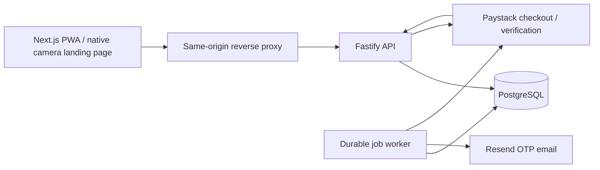
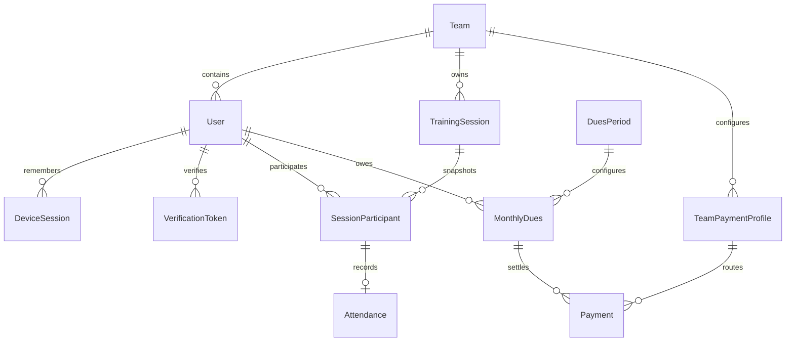

# Backend architecture

## System boundaries

PitchPresence serves isolated football teams, with one team per account. It is an npm-workspaces monorepo with a Fastify TypeScript API, a background worker, browser-safe contracts, a server-only database package, and PostgreSQL/Prisma migrations. `apps/web` contains the Next.js frontend.

Each module owns HTTP routes and business services. Routes validate input, authorize roles and translate requests. Services enforce domain rules and transaction boundaries. Provider adapters isolate network calls from transactions and tests. Shared packages contain no credentials or Prisma models suitable for browser import.

## Data model

The DuesPeriod relationship is logical: an unpaid record can exist before management configures that month. UUIDs identify entities. PostgreSQL stores UTC timestamps; Lagos determines month and date boundaries. Money is integer kobo in NGN. Unique constraints protect email identity, attendance per session/player, dues per player/month, provider references, and job deduplication.

Additional SQL constraints enforce one OPEN training session per team, one pending Paystack payment per dues record, valid location/amounts, consistent manual attendance actors and manual reversals. Audit rows reject UPDATE and DELETE through a trigger. Development schema changes must be migrations so these constraints remain present.

## Identity and eligibility

Reusable invitations expire after seven days and can be revoked. Registration forces PLAYER role, hashes the PIN and queues a six-digit OTP. Verification activates the player and creates a remembered device. Invites can register multiple players; a unique normalized email prevents duplicate identities.

PINs and staff passwords use Argon2id; OTP hashes are keyed digests; device tokens are random and hashed. Email-job OTPs are AES-GCM encrypted and erased from job payloads after delivery or final email failure. Session expiry is an absolute 30 days. Resends supersede older challenges. PIN and password resets revoke all remembered devices. Deactivation revokes devices without deleting history.

Coaches/managers self-register with a 8–128-character password with uppercase, lowercase, a number and a symbol, verify email, then create a team or accept an email-bound staff invitation. Staff use password login; players use PIN login. Both coach/manager titles map to MANAGER. Email is globally unique and membership cannot transfer. The legacy manager PIN provisioning CLI has been removed.

## Attendance invariants

Management starts sessions manually with a fresh location capture (at most two minutes old) and accuracy <=100 metres. Coordinates are manager-supplied device readings; they do not independently prove player location. Players joining after a session opens are eligible starting with the next session. Names and eligible player IDs are snapshotted at opening.

Signed HS256 QR tokens last 30 seconds from issuance; the display refreshes every 10 seconds, leaving extra time for network delays after scanning. Tokens contain team ID, session ID, issuer, audience, timestamps and nonce, without location or personal data. A token is shared across players, so it is not consumed globally. Unknown-device login never extends expiry.

Check-in, manual marking and closure lock the same session row. Attendance revalidates the QR after waiting for the lock. Arrival and close timestamps use `clock_timestamp()` after lock acquisition. No new write is admitted after committed closure. Manual entries identify the manager. Duplicate valid requests return the existing record. Closed-session absence is derived from the saved roster; an open session uses NOT_CHECKED_IN.

## Dues and payment invariants

Dues records are lazily materialized from a player's activation month through the current Lagos month. Earlier months are not invented. Current unpaid records can be displayed before the minimum is configured; checkout remains unavailable until both minimum configuration and team bank connection.

Players choose amounts >= a management-configured minimum. The first checkout initialization or external confirmation freezes that month's minimum. One verified qualifying payment settles the month; no partial-payment balance is computed. Past unpaid months may be settled without resetting other records.

External confirmations include amount, manager, timestamp and optional reference. Reversal requires a reason and preserves the original payment. Dues status is recomputed from remaining successful, unreversed payments. Verified Paystack transactions are never reversed through the manual endpoint.

A local reference and pending payment are committed before initialization calls Paystack. Initialization uses a durable idempotency fingerprint. Pending checkouts are reused. Webhook signature checks use original bytes and HMAC-SHA512. Webhook and browser verification converge on the same settlement service, which verifies status, reference, amount, currency, customer email and the snapshotted subaccount destination. Settlement locks dues then payment and atomically records financial success and dues status.

Unknown network outcomes remain pending. Two distinct successful payments are both retained; the additional settlement is flagged for review. A successful checkout is never inferred from browser navigation.

## Background processing and observability

Jobs are claimed with `FOR UPDATE SKIP LOCKED`, a 60-second lease and a claim token. Provider calls have ten-second deadlines. Completion and rescheduling require the current claim token. OTP delivery retries at most five times with bounded backoff. Payment verification retries every five minutes and escalates unresolved work after 24 hours.

Logs contain request ID, route, status and latency without tokens, query strings or credentials. Management can inspect audit events and operational counts. `/health/live` checks process health; `/health/ready` checks the database. See the runbook for external alerting and recovery.

## Tenant boundaries and bank profiles

Role-protected routes resolve `teamId` from the authenticated user, never request fields. Unassigned verified staff may only access onboarding and account/session endpoints. Lists, detail lookups, QR issuance/check-in, dues configuration, financial mutations, operations and audits are scoped to that team. Composite SQL foreign keys reject cross-team associations; membership and payment destination snapshots are immutable. A DuesPeriod is unique by `(teamId, month)` and uses a UUID for locking.

`GET /management/overview` supplies the team's current session, five recent sessions, complete player counts, current paid/unpaid counts and resumable setup flags. Training history is paginated by descending `(startedAt, id)`. No complete-history download is needed to discover current training.

Bank setup reauthenticates the staff password, checks the selected bank, resolves and confirms account name, then commits a PENDING profile before contacting Paystack. A successful active subaccount activates the profile. A timeout/inactive response moves the setup to REVIEW; a read-only metadata lookup can reconcile it without a second creation. Previously connected profiles remain active while a replacement is reviewed. READY profiles are immutable. Only masked bank details appear in public settings. Each PAYSTACK payment snapshots team, profile and subaccount code. Provider initialization sets `percentage_charge: 0` on creation and uses `transaction_charge: 0`, `bearer: subaccount` at checkout. Gross verified amount settles dues; provider fees are charged to the team.

Payment and invitation jobs store team context. Workers re-check referenced payment/invitation ownership before acting. Pre-team email verification jobs may have null team context; email, user and challenge identity still must match. System financial audit events retain the payment's team.
